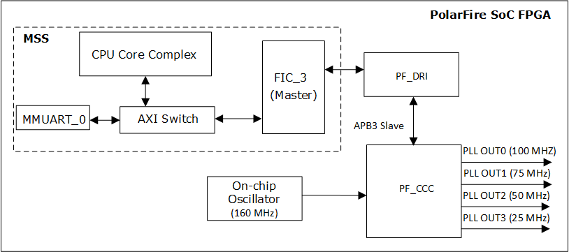
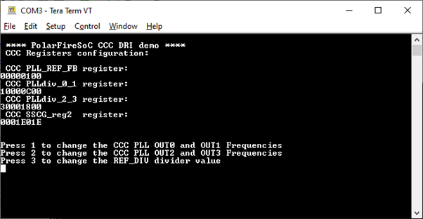
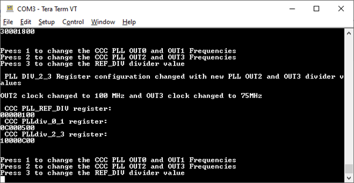
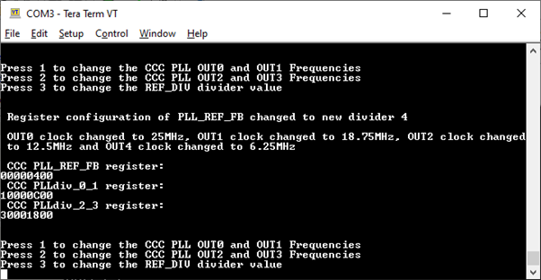

# Dynamic Reconfiguration of Hard IPs

## Objective:

This application demonstrates how to reconfigure PolarFire SoC FPGA Hard IP blocks such as Clock Conditioning Circuits (CCC) and Transceivers without reprogramming the FPGA.

## Description

In the reference design, the south-west CCC IP is configured to generate four fabric output clock frequencies of 100 MHz (PLL OUT0), 75 MHz (PLL OUT1), 50 MHz (PLL OUT2), and 25 MHz (PLL OUT3) respectively. These PLL output clocks are generated from a reference clock of 125 MHz. The CCC IP includes a Dynamic Reconfiguration Interface (DRI), which is enabled for dynamic reconfiguration without reprogramming the device. The PF_DRI block in the fabric is used to interface the CCC's DRI bus with MSS FIC3 interface. One of processors in the MSS can dynamically modify the CCC configuration register values through FIC3 interface.

The following figure shows the top-level block diagram of the design.

Per [PolarFire SoC Register map](http://www.microsemi.com/index.php?option=com_docman&task=doc_download&gid=1244581), the address offset for the south-west CCC registers starts at 0x08400000. Since these CCC registers are accessed through FIC3 path the base address for the CCC registers becomes 0x4840 0000 (0x4000 0000 + 0x0840 0000).

Refer to the bit definitions of the south-west CCC register documented in the PolarFire SoC Register map.

Table1: CCC Registers

| S.No | Register Name| Description | Address |
|------|--------------|-------------|---------|
| 1 | SOFT RESET | Soft reset Register | 0x4840 0000|
| 2 | PLL_CONTROL | PLL control register | 0x4840 0004 |
| 3 | PLL_REF_FB | PLL reference and feedback registers | 0x4840 0008 |
| 4 | PLL_DIV_0_1 | PLL 0/1 division registers| 0x4840 0010 |
| 5 | PLL_DIV_2_3 | PLL 2/3 division registers| 0x4840 0014 |
| 6 | SSCG_REG2 | SSCG register2 | 0x4840 002C |

The current design provides the option to access the south-west CCC registers via the MSS DRI interface using the System Controller Bridge (SCB). In this case, the CCC registers are accessed with an offset of 0x30000000 and hence the start of the first CCC register becomes 0x38400000. In this case, the DRI IP in the fabric is not used for dynamic reconfiguration.

In the application, the following sequence is used for a glitch-free CCC reconfiguration:

1. The Peripheral reset field (PERIPH) of SOFT_RESET register is asserted to reset the PLL.
2. The PLL core enable field (REG_POWERDOWN_B) of the PLL control register is de-asserted to disable the PLL.
3. The required PLL divider registers (PLL_DIV_0_1 or PLL_DIV_2_3 or PLL_REF_FB) are written with new values.
4. The Peripheral reset field (PERIPH) of SOFT_RESET register is de-asserted to release the PLL.
5. The PLL core enable field (REG_POWERDOWN_B) of the PLL control register is asserted to enable the PLL.

The existing values of the four CCC output clocks can be derived using the following formula:

PLL OUT[X] = (REF_CLK × FB DIV)/(REF_DIV × (4 × OUT[X] DIV)

where, 

           REF_CLK is the reference clock (125 MHz) to CCC PLL.

           X = 0,1,2, and 3.

The PLL output divider values can be read from the following register bit fields as HEX values. 

-PLL OUT0 DIV = PLL_DIV_0_1 reg[14:8]
-PLL OUT1 DIV = PLL_DIV_0_1 reg[30:24]
-PLL OUT2 DIV = PLL_DIV_2_3_reg[14:8]
-PLL OUT3 DIV = PLL_DIV_2_3_reg[30:24]
-REF_DIV = CCC_PLL_REF_DIV_reg[13:8]
-FB DIV = CCC_SSCG_reg2[11:0]

## Requirements

-Icicle Kit (MPFS250T-FCVG484EES)
-SoftConsole v2021.1
-Serial Terminal program (PuTTY or TeraTerm)
-Host PC - Windows 10 OS

## Pre-Requisite:

Before running the user application, ensure to complete the following steps:

1. Setting up the [jumpers](https://github.com/polarfire-soc/polarfire-soc-documentation/blob/master/boards/mpfs-Icicle-kit-es/updating-Icicle-kit/updating-Icicle-kit-design-and-linux.md) on Icicle Kit.
2. The CCC PLL output clocks are mapped to J26 connector pins 32, 36, 38, and 40 on the Icicle kit. Connect these J26 pins to an Oscilloscope for observing the PLL output frequencies.
3. Setting up the Serial Terminal:
   -Select the COM port which is connected to the following interface: Silicon Labs Quad CP2108 USB to UART BRIDGE: Interface 0.
   -Set Baud rate to 115200, Set Data to 8-bit, Set Flow control to None.
4. Use FlashPro Express to program the Icicle Kit with the job file. The Libero programming job file is available at https://github.com/polarfire-soc/Icicle-kit-reference-design.
5. Download SoftConsole project from the following link: Link TBD

## Running the User Application

By running this application, the PLL output clocks are dynamically changed to the following new values:

-PLL OUT0 is changed to 240 MHz
-PLL OUT1 is changed to 100 MHz
-PLL OUT2 is changed to 100 MHz
-PLL OUT3 is changed to 75 MHz

After the device is programmed, power cycle the board. To run the application, complete the following steps:

Step 1: Launch SoftConsole v6.6 with the provided CCC DRI project.

Step 2: Build the SoftConsole project in release mode. In this project, LIM is specified as stack and eNVM is specified as code section in the Linker script. 

Step 3: Select Run > External Tools > PolarFire SoC program non secure boot mode 1 for booting the application from eNVM directly.

Step 4: The DRI menu is printed on the UART Serial Terminal (COM5, in this case) as shown in the following figure.

Step 5: Press 1 to change the PLL OUT0 and PLL OUT1 divider values. The PLL_DIV_0_1 register is written with 0x0C000500 and the same is displayed on the serial terminal. On the Oscilloscope, the new output frequencies PLL OUT0 (240 MHz) and PLL OUT1 (100 MHz) can be observed.

Step 6: Press 2 to change the PLL OUT2 and PLL OUT3 divider values. The PLL_DIV_2_3 register is written with 0x30001800 and the same is displayed on the serial terminal. On the Oscilloscope, the new output frequencies PLL OUT2 (100 MHz) and PLL OUT3 (75 MHz) can be observed.

Step 7: Power cycle the board to load the initial PLL output values from the design.

Step 8: The PLL output frequencies can also be reconfigured by changing the PLL_REF_FB register value. Press 3 for changing the reference clock divider value to 0x00000400. The PLL output values change to 125 MHz, 93.75 MHz, 62.25 MHz, and 31.25 MHz respectively. On the Oscilloscope, the new output frequencies can be observed.

# Appendix: Transceiver Dynamic Reconfiguration

The Transceiver (XCVR) registers can also be changed dynamically to change the XCVR data rate. This section describes the required registers and the general procedure for dynamically changing the Transceiver data rate in a PolarFire SoC design.

## Required Design Changes
-In the PF_DRI Configurator, the Transceiver Q0_Lane2 interface must be selected. The Q0_LANE2_DRI output port is exposed. Selected Quad0 Lane 2 as an example here.
-In the XCVR IP Configurator, select the Enable DRI option. The LANE0_DRI_SlAVE input port is exposed.
-Connect the MSS FIC3 master to the APBS port of the DRI IP.
-Connect the DRI:Q0_LANE2_DRI output port to the Transceiver:LANE0_DRI_SlAVE input port.
-Map the XCVR TX_CLK and RX_CLK ports to 32 and 36 pins on J26 connector for observing the rate change.

## Description

The XCVR reference clock is sourced from an on-board 100 MHz oscillator. There is no provision for an external loopback on the Icicle Kit. Use SmartDebug to initiate internal loopback. The DRI IP, in the fabric, is interfaced with the Transceiver IP via APB for dynamic reconfiguration. The APB bus is used to dynamically modify the Transceiver register values. The following Quad0_Lane2 XCVR registers are accessed via FIC3 from MSS with an offset of 0x40000000.

Table2 : XCVR Registers of Q0 LANE2 
| S.NO | Register Name | Description | Register Map | Required Values for DRI |
|------|---------------|-------------|--------------|-------------------------|
| 1 | SER_RSTPD| PMA Lane2 Serializer Reset and PD (Base address) | 0x4104 4078 | 0x3 - Assert Reset, 0x1 - DeAssert Reset |
| 2 | DES_RSTPD| PMA Lane2 Deserializer RESET and PD | 0x4104 404C| 0x0032 - Assert Reset, 0x0010 - De-Assert reset |
| 3 | TX PLL DIV1| PMA CMN TXPLL 1 Dividers | 0x41050010 | 0x0140000 |
| 4 | TX PLL DIV2| PMA CMN TXPLL 2 Dividers | 0x41050014 | 0x1000000 |
| 5 | SER_CLK_CNTRL| PMA Lane2 Serializer Clock Control | 0x4104 4074 |	0x73 - 1.25G, 0x71- 2.5G, 0x70 - 5G |
| 6 | DES_RX_PLL_DIV| PMA Lane2 SSCG Register | 0x4104 4040 | 0x4414- 1.25G, 0x2214 - 2.5G, 0x228   - 5G |
| 7 | LRST_R0| PCS LANE2 PSC LSRT Register (resets PCS Tx / Rx domain logic) | 0x4004 4068 | 0x0D0D - Assert Reset, 0x0404 - DeAssert Reset |

The base address of PMA Lane2 is 0x01044000, PCS LANE2 is 0x0004 4068,  and PMA CMN is 0x01050000.

## Instruction Sequence for Transceiver Rate Changes
1. Assert Reset for the serializer.
2. Assert Reset for the deserializer.
3. Change TX_PLL_DIV_1 register.
4. Change TX_PLL_DIV_2.
5. Change SER_CLK_CNTRL.
6. Change DES_RXPLL_DIV.
7. De-Assert reset for the serializer.
8. De-assert reset for the deserializer.
9. Assert and de-assert the soft PCS reset.

Using SoftConsole, follow the above mentioned sequence for writing to the registers listed in Table2. The following table shows the expected TX_CLK and RX_CLK values.
|S.No| Data Rate Selection | Expected Clock Frequency at TX_CLK and RX_CLK Ports |
|----|---------------------|-----------------------------------------------------|
| 1 | 1.25G | 25 MHz |
| 2 | 2.5G | 50 MHz |
| 3 | 5G | 100 MHz |

The clock changes for each data rate change can be observed on an Oscilloscope. Use SmartDebug to observe the bit error rate.
  

