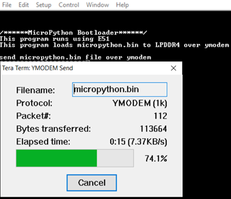

# MicroPython

## Objective

The Scope of the project is to build MicroPython for PolarFire SoC RISC-V architecture and execute the MicroPython on ICICLE KIT. 

## Design Description

The block diagram of the design is as follows

The bootloader application runs using E51 monitor core and gets the MicroPython application over ymodem. The MicroPython application is copied to LPDDR4. Now, E51 monitor core switches the execution to U54 application core to execute MicroPython from LPDDR4. The Command line interface (CLI) of MicroPython will be shown on serial terminal program. The MSS UART and GPIO will be integrated into MicroPython Source code to show basic functionality with commands.

## Libero Programming job file link 

[Job File](https://github.com/polarfire-soc/icicle-kit-reference-design/releases/download/2020.12/Icicle-Kit-2020.12.zip)

## Requirements

-ICICLE Kit (MPFS250T-FCVG484EES)

-SoftConsole v6.5

-Serial Terminal program (PuTTY or TeraTerm)

-Host PC - Windows 10 OS

## Pre-Requisite

Before running the user application, ensure to complete the following steps:
1. Setting up the jumpers[jumpers](https://github.com/polarfire-soc/polarfire-soc-documentation/blob/master/boards/mpfs-icicle-kit-es/updating-icicle-kit/updating-icicle-kit-design-and-linux.md) on the ICICLE Kit.
2. Setting up the Serial Terminal 
    - Select the COM port which is connected to the following interface: Silicon Labs Quad CP2108 USB to UART BRIDGE: Interface 0
    - Set Baud rate to “115200”, Set Data to 8-bit, Set Flow control to None.
3. Use FlashPro Express to program the ICICLE Kit with the job file 
4. Download [SoftConsole project](https://bitbucket.microchip.com/projects/FPGA_PFSOC_ES/repos/apps/browse/baremetal_applications?at=refs%2Fheads%2Fdevelop_12_6_deliverables)
5. Download the [micropython.bin](https://bitbucket.microchip.com/projects/FPGA_PFSOC_ES/repos/apps/browse/baremetal_applications/MicroPython/micropython.bin?at=develop_12_6_deliverables)

   The micropython.bin file can be cross complied using Linux host machine as explained in Cross-Compiling MicroPython for Polarfire SoC ICICLE Kit (RISCV architecture).
   
## Running the Application 

After the device is programmed, power cycle the board. Build and launch the SoftConsole project in Debug mode. In Debug mode, the application runs from loosely integrated memory (LIM). The application prints the menu on the Tera Term program through the UART interface, as shown in following figure. This program waits to load the micropython.bin to LPDDR4 over ymodem.

Note: This SoftConsole project can also be built in release mode and run from eNVM. Click Run > External Tools > PolarFire SoC program non-secure boot mode 1 to run the application from eNVM.

To run the demo, perform the following steps:

1. On Tera Term, select File > Transfer > YMODEM > Send to transfer micropython.bin as shown in the following figure. The Tera Term: YMODEM Send Dialog appears.

2. Browse the micropython.bin and click Open as shown in the following figure.

3. The file is transferred as shown in the following figure. It takes around 30 sec.

4. After transferring micropython.bin, bootloader switches the execution to the MicroPython. U54 starts executing MicroPython from LPDDR4 and the MicroPython command prompt appears on Tera Term as shown in the following figure.

5. Using the MicroPython, you can switch ON and OFF the LEDs. Following are the commands to switch ON and OFF the LEDs. 

- from machine import Pin
- led = Pin<<''GPIO2_0'', 16>, Pin.OUT>
- led.value<1> (Now, the LED1 is ON)
- led.value<0> (to switch OFF the LED1)

6.  Using the Micropython, you can perform mathematical operations as shown in the following figure.

## Cross-Compiling MicroPython for PolarFire SoC ICICLE Kit (RISC-V architecture)

Ensure to install prebuilt toolchain for RISC-V or SoftConsole v6.5 on the Linux host machine. Download the MicroPython source code from the following link: Bitbucket link.

To cross compile the MicroPython, follow:

1. Export the toolchain path.
export PATH=$PATH:/path to Microchip/SoftConsole-v6.5/riscv-unknown-elf-gcc/bin
For example, export PATH=$PATH:</home/microchip/Microchip/SoftConsole-v6.5/riscv-unknown-elf-gcc/bin

2. Build the MicroPython.
   untar micropython_release_1_9_3.tar.gz
   tar -xvzf micropython_release_1_9_3.tar.gz
   cd path to micropython folder/micropython_release_softfloat/ports/icicle_miv
   For example, cd micropython1_9_3/micropython_release_softfloat/ports/icicle_miv
   make clean
   make CROSS=2 V=1
3. Generate the hex file.
   cd build
   riscv64-unknown-elf-objcopy -O ihex micropython.elf firmware.hex --change-section-lma *-0x80000000
4. Generate the bin file.
   cd build
   riscv64-unknown-elf-objcopy -O binary -j .isr_vector -j .text -j .data  micropython.elf micropython.bin

 On successful compilation of source code, the output file (micropython.bin) is generated.

