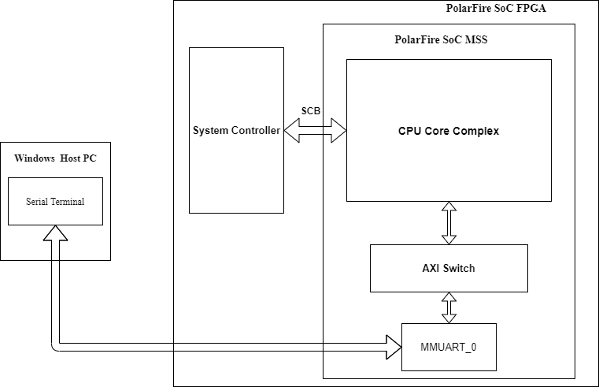

# System Services

## Objective

This SoftConsole project demonstrates the execution of PolarFire SoC System Services on the MPFS-ICICLE-Kit using the MSS System Service driver.  

## Description

As shown in the following figure, the MSS is interfaced with the system controller via the SCB (system controller bus) bridge. MSS initiates System Service requests via the SCB bridge which includes System Service Interface (SSI).

The following points summarize the System Service flow:

- The host PC sends the System Service request to MSS MMUART via the UART interface.
- MSS initializes the system controller and sends the requested System Service command to the system controller.
- The system controller executes the System Service command and sends the relevant response to MSS over the mailbox interface.
- MSS receives the service response and forwards the receive data to the UART interface.

By default, the SCB bridge and the SCB Master block are available in the MSS, there is no need for a separate configuration.

## Requirements

- ICICLE Kit (MPFS250T_ES-FCVG484E)
- SoftConsole v6.5
- Serial Terminal program (PuTTY or TeraTerm)
- Host PC - Windows 10 OS 

## Pre-Requisite

Before running the user application, ensure to complete the following steps:

1. Setting up the [jumpers](https://github.com/polarfire-soc/polarfire-soc-documentation/blob/master/boards/mpfs-icicle-kit-es/updating-icicle-kit/updating-icicle-kit-design-and-linux.md) on the ICICLE Kit.
2. Setting up the Serial Terminal:
   - Select the COM port which is connected to the following interface: Silicon Labs Quad CP2108 USB to UART BRIDGE: Interface 0. 
   - Set Baud rate to “115200”, Set Data to 8-bit, Set Flow control to None. 
3. Use FlashPro Express to program the ICICLE Kit with the [PolarFire SoC ICICLE Kit Reference Design job file](https://github.com/polarfire-soc/polarfire-soc-documentation/blob/master/boards/mpfs-icicle-kit-es/updating-icicle-kit/updating-icicle-kit-design-and-linux.md). 
4. Download the provided System Services application [softconsole_project.7z](https://bitbucket.microchip.com/projects/FPGA_PFSOC_ES/repos/apps/browse/baremetal_applications/System_Services/softconsole_project.7z?at=refs%2Fheads%2Fdevelop_12_6_deliverables).

## Running the Application

The System Services SoftConsole project must be launched in debug mode for running the application. For detailed instructions to run the System Services application, see [AC492: Running BareMetal User Applications on PolarFire SoC FPGA Application Note.](http://www.microsemi.com/index.php?option=com_docman&task=doc_download&gid=1245407)

Note: This SoftConsole project can also be built in release mode and run from eNVM. Select Run > External Tools > PolarFire SoC program non secure boot mode 1 option to program the eNVM with the application and execute it.

