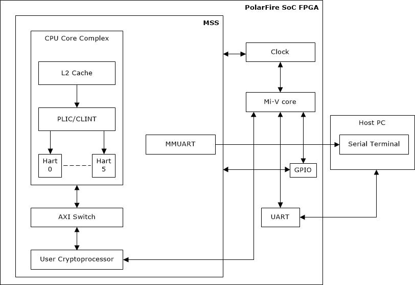

# Dynamic Switching of User Cryptoprocessor Ownership

## Objective
The scope of the reference design is to perform cryptographic operations such as encryption, decryption, dynamic switching of User Cryptoprocessor ownership from microcontroller subsystem (MSS) to fabric and vice versa using the User Cryptoprocessor as a coprocessor to a host general purpose processor.

Note: Microchip provides an Athena TeraFire Cryptographic Applications Library (CAL) to access User Cryptoprocessor functions. CAL driver requires a license. Email [FPGA_marketing@microchip.com](FPGA_marketing@microchip.com) to request the design files. This design is targeted for PolarFire SoC Icicle kit.

## Description
This reference design shows how to perform switching of the User Cryptoprocessor from PolarFire SoC MSS to Fabric and vice versa. The User Cryptoprocessor can be accessed from MSS or Fabric. The User Cryptoprocessor is a hard block in PolarFire SoC FPGAs and its maximum operating frequency is 200 MHz. It is accessible to MSS, or a soft processor in the FPGA fabric through the AHBLite slave interface for control and primary data input and output. The User Cryptoprocessor has built-in DMA to offload the main processor from performing data transfers between the User Cryptoprocessor and the user memory. The DMA functionality is accessible from fabric through an AMBA AHB-Lite master interface. 

The User Cryptoprocessor can be configured in the following ways using Standalone MSS configurator:

Need to add table

In this reference design, Shared-MSS mode is used for configuration. In the Shared-MSS mode, the User Cryptoprocessor is initially connected to the MSS, and can be requested by the Fabric. The ownership of the User Cryptoprocessor can be switched between MSS and Fabric via a handshake interface. The handshake interface is asynchronous with synchronizers inside the MSS as required.

The following table lists the ports that are exposed from MSS block when Share-MSS or Shared-Fabric mode is selected from the Standalone MSS configurator.

Need to add table

The following figure shows the top-level block diagram of the design.

In the preceding figure, MMUART is used for user interface for MSS-related User Cryptoprocessor operations and Fabric UART is used for fabric-related User Cryptoprocessor operations. When User Cryptoprocessor is switched from MSS to Fabric, then User Cryptoprocessor uses fabric clock. Handshaking signals (as mentioned in preceding table) are controlled using GPIOs by connecting them as inputs or outputs in the Fabric. The CRYPTO_RELEASE_F2M and CRYPTO_REQUEST_F2M ports are driven from the outputs of the CoreGPIO. The CRYPTO_MSS_REQUEST_M2F, CRYPTO_MSS_RELEASE_M2F, CRYPTO_OWNER_M2F, and CRYPTO_MSS_OWNER_M2F ports are connected as inputs to the CoreGPIO. 

The switching and the handover requires co-operation between the MSS and Fabric design to ensure a secure handover. Assuming the MSS is initially the master, the ownership switching happens as follows:

1. The Fabric requests a handover using MSS Crypto Control Register.
2. The MSS design purges the Crypto core, and release it by asserting CRYPTO_MSS_RELEASE_F2M signal.
3. The Crypto core is put into reset, and the clock switched to the Fabric by the Crypto ownership FSM.
4. The Crypto core is released from reset by the Crypto ownership FSM and then, it is available to the Fabric.

The same occurs in the opposite direction (that is, from Fabric to MSS) when MSS requests for access to User Cryptoprocessor from Fabric.

The following figure shows the transfer of User Cryptoprocessor ownership from MSS to Fabric. In the current design, the MSS has the ownership to the User Cryptoprocessor by default as Shared MSS is selected from the Standalone MSS configuration. To change the ownership from MSS to Fabric, MSS has to release the User Cryptoprocessor access using CRYPTO_MSS_RELEASE_M2F port and Fabric should request for access using CRYPTO_REQUEST_F2M port or  Fabric can request for access first using CRYPTO_REQUEST_F2M port then MSS has to release the User Cryptoprocessor access using CRYPTO_MSS_RELEASE_M2F port. When this is done, the ownership is transferred to Fabric. User can check transfer of ownership by reading the status of  the CRYPTO_OWNER_M2F port and perform the required User Cryptoprocessor operations.

 

The following figure shows the transfer of the User Cryptoprocessor ownership from Fabric to MSS. To change the ownership from Fabric back to MSS, Fabric has to release the User Cryptoprocessor access using CRYPTO_RELEASE_M2F port and then MSS should request for access using CRYPTO_MSS_REQUEST_F2M port or  MSS can request for access first using CRYPTO_MSS_REQUEST_F2M port then Fabric has to release the User Cryptoprocessor access using CRYPTO_RELEASE_M2F port. When this is done,  the ownership is transferred back to MSS. User can check the transfer of ownership by reading the status of CRYPTO_MSS_OWNER_M2F port and perform the required User Cryptoprocessor operations. 

 

## Requirements

- ICICLE Kit (MPFS250T_ES-FCVG484E)
- SoftConsole 2021.1
- Libero SoC 2021.1
- Serial Terminal program (PuTTY or TeraTerm)
- Host PC - Windows 10 OS

## Pre-Requisite

Before running the user application, ensure to complete the following steps:
1. Setting up the [jumpers](https://github.com/polarfire-soc/polarfire-soc-documentation/blob/master/boards/mpfs-icicle-kit-es/updating-icicle-kit/updating-icicle-kit-design-and-linux.md) on the ICICLE Kit.
2. Setting up the Serial Terminal - one for MSS (Interface 0) and one for Fabric (Interface 1):
    - Select the COM port which is connected to the following interface:  Silicon Labs Quad CP2108 USB to UART BRIDGE: Interface 0.
    - Set Baud rate to <93>115200<94>, Set Data to 8-bit, Set Flow control to None.
3. Use FlashPro Express to program the ICICLE Kit with the provided programming file.

## Running the Application

After the device is programmed, power-cycle the board. The application prints the menu on the Tera Term program through the UART interface 0 (COM5) and interface 1 (COM6), as shown in following figures. COM5 is used for MSS and COM6 is used for Fabric. 

 

Use the following test vector to verify the AES CCM encryption and decryption operation:

- AES Key = 404142434445464748494A4B4C4D4E4F
- Nonce = 101112131415161718191A1B
- Additional authentication data (AAD) = 000102030405060708090A0B0C0D0E0F10111213
- Input data to Encrypt and authenticate = 202122232425262728292A2B2C2D2E2F3031323334353637
- Encrypted Data = E3B201A9F5B71A7A9B1CEAECCD97E70B6176AAD9A4428AA5484392FBC1B09951

To run the demo, perform the following steps:

1. Press '1' to perform AES CCM encryption using the User Cryptoprocessor. The application prompts to enter a 128-bit key, as shown in the following figure. 

