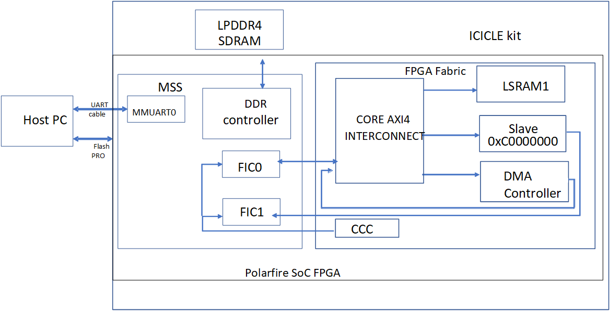

# Accessing shared LPDDR4 memory from fabric and linux user application

## Objective:

Using this application, a shared uncached LPDDR4 memory space is accessed by  linux user application using UIO framework and fabric. 


## Description:

In the Libero design, fabric LSRAM and fabric DMA Controller are interfaced to MSS via FIC. The shared LPDDR4 memory region (0XC0000000-0xC000FFFF) is accessed via  uncached path for fabric as shown in following figure.

For more information on Libero hardware design, please refer AC489 Application Note.



The pre-built Linux image includes the following customization to access the uncached LPDDR4 region from user space.

- A device tree node (uio-generic) is added for LSRAM and uncached LPDDR4 memory addresses in the device tree file. 
- A device tree node (uio-generic) is added for DMA Controller memory address in the device tree file.
- A driver for Fabric DMA controller is added in the uio framework to handle DMA interrupt.
- UIO framework with DMA support is enabled in the Linux configuration file (defconfig).
- User application performs data transfers from LSRAM to LPDDR4 using uio-dev node (/dev/uio).

The following table lists the addresses and sizes included in device tree nodes based on AC489 Libero design.

| Component | Start Addr | Size |
| --- | --- | --- |
| LSRAM | 0x61000000 | 64 K |
| LPDDR4 | 0xC0000000 | 64 K |
| DMA Controller | 0x60020000 | 4 K |

The C application includes the following DMA register configuration to initiate data transfers.

- Source address register (LSRAM)
- Destination address register (LPDDR4)
- Byte count register
- Descriptor0 configuration register
- Interrupt mask register (Configures Interrupt)
- Start operation Resister (starts DMA transfer)

The C application waits for the interrupt assertion and validates the data once the DMA transfer is completed. 

## Hardware Requirements:

- ICICLE Kit (MPFS250T-FCVG484EES)
- Host PC - Windows 10 OS

## Pre requisite:

For running this application please ensure the following as described in AC489 user guide:

1. Setup the ICICLE kit
2. Programming the provided job file [Programming_Job_File](https://bitbucket.microchip.com/projects/FPGA_PFSOC_ES/repos/apps/browse/linux_applications/Hardware/Programming_Job_File?at=refs%2Fheads%2Fdevelop_ac489)
3. Programming the provided Linux image [mpfs-dev-cli-icicle-kit-es-AC489_linux.rootfs.wic](https://bit.ly/3ln5K4Y).
4. Boot Linux

## Running the User Application:

The user application (uio_dma_interrupt) is available under /microchip-apps directory in rootfs.

```
root@icicle-kit-es:~# cd /microchip-apps/  
```

Type the ./uio_dma_interrupt command and Press Enter to execute the application.

```
root@icicle-kit-es:/microchip-apps# ./uio_dma_interrup

         # Choose one of  the following options:
         Enter 1 to perform memory test on LSRAM
         Enter 2 to perform DMA transfer from LSRAM to uncached LPDDR4 region
         Enter 3 to Exit  
```

Enter 1 to perform memory test on LSRAM.

After successful completion of memory test on LSRAM, "LSRAM memory test passed successfully" message is displayed on console.

```
root@icicle-kit-es:/microchip-apps# ./uio_dma_interrup
         # Choose one of  the following options:
         Enter 1 to perform memory test on LSRAM
         Enter 2 to transfer data from LSRAM to uncached LPDD4 via DMA
         Enter 3 to Exit
1

Writing incremental pattern starting from address 0x61000000

Reading data  starting from address 0x61000000

Comparing data
..............................................................................


**** LSRAM memory test passed successfully *****


         # Choose one of  the following options:
         Enter 1 to perform memory test on LSRAM
         Enter 2 to transfer data from LSRAM to LPDD4 via DMA access
         Enter 3 to Exit
```

Enter 2 to perform data transfer from LSRAM to uncached LPDDR4 memory region using Fabric DMA controller:

```
root@icicle-kit-es:/microchip-apps# ./uio_dma_interrup
         # Choose one of  the following options:
         Enter 1 to perform memory test on LSRAM
         Enter 2 to transfer data from LSRAM to uncached LPDD4 via DMA
         Enter 3 to Exit
2

Initialized LSRAM (64KB) with incremental pattern.
Fabric DMA controller configured for LSRAM to LPDDR4 data transfer.
        Source Address (LSRAM) - 0x61000000
        Destination Address (LPDDR4) - 0xc0000000

        Byte count - 0x10000

DMA Transfer Initiated...

DMA Transfer completed and interrupt generated.

Cleared DMA interrupt.

Comparing LSRAM data with LPDDR4 data....

***** Data Verification Passed *****

Displaying interrupt count by executing "cat /proc/interrupts":

(Show the output for one interrupt)


         # Choose one of  the following options:
         Enter 1 to perform memory test on LSRAM
         Enter 2 to transfer data from LSRAM to uncached LPDD4 via DMA
         Enter 3 to Exit
```

If you perform option 2 again, the interrupt count should be incremented.

Enter 3 to exit the application.

